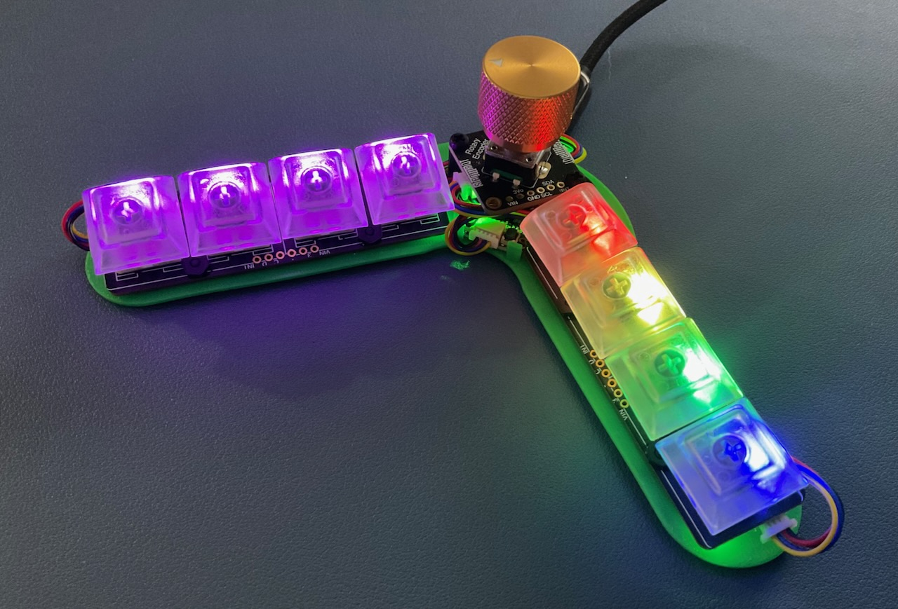
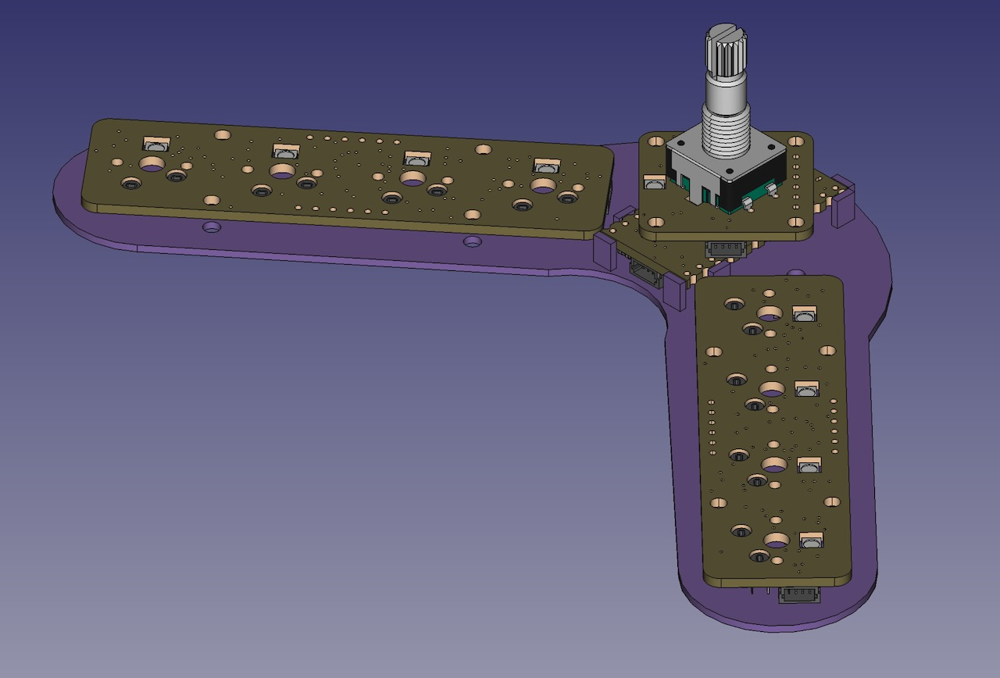

NeoBoomerang - A One Handed Chording Keyboard

Features
===
* I2C connections STEMMA QT connnected
  * Only one NeoKey jumper pad requires soldering
* Encoder for scrolling 
* 10 NeoPixel LEDs
* USB-C
* Red Cherry MX (silent, low force)
* CircuitPython 9.x based
* Emulates a 60% keyboard with only 8 keys

FreeCAD
===
* FreeCAD 0.21.2
* Minimal 3D printed plate for mounting

BOM
===
| Item       | Source     | Part Number        |
|:----------:|:----------:|:------------------:|
| Controller | Adafruit   | [KB2040](https://www.adafruit.com/product/5302) |
| Keys       | Adafruit   | [NeoKey 1x4 QT I2C](https://www.adafruit.com/product/4980) |
| Encoder    | Adafruit   | [I2C Stemma QT Rotary Encoder](https://www.adafruit.com/product/5880) |
| Cables     | Adafruit   | [STEMMA QT 50mm](https://www.adafruit.com/product/4399) |
| Cables     | Adafruit   | [STEMMA QT 200mm](https://www.adafruit.com/product/4401) |
| Screws     | Adafruit   | [M2.5 Machine Screws / Stand-off](https://www.adafruit.com/product/3299) |
